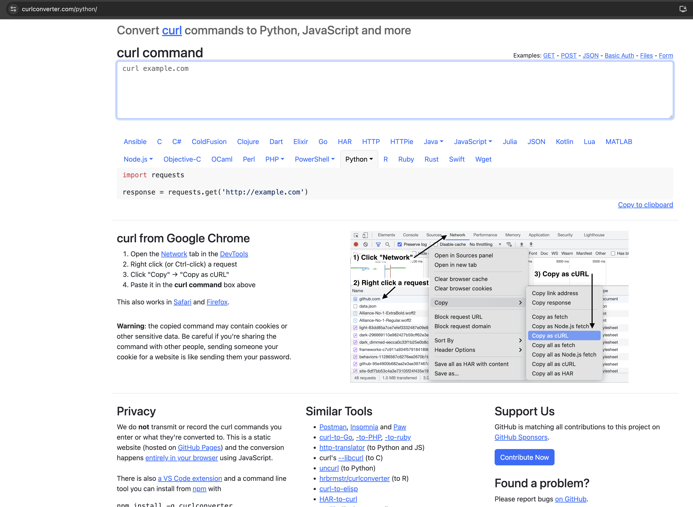
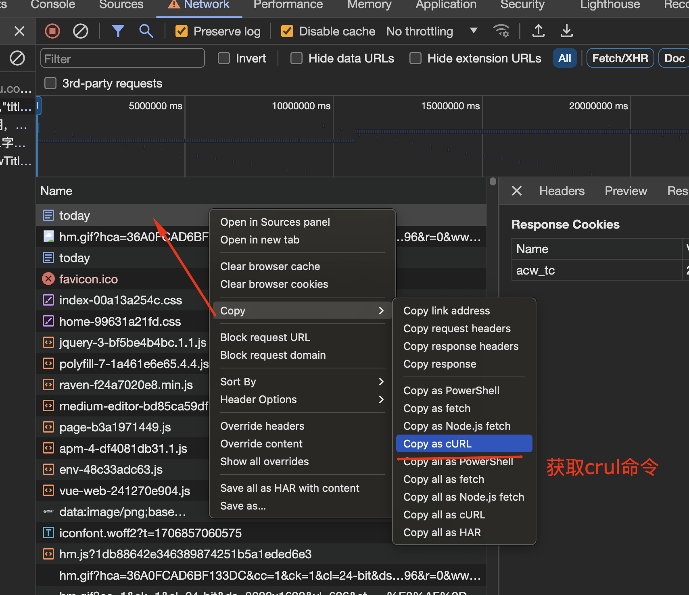

# crawler-learn


level | name | note  
:--:|----|---  
1 | XHR debug | [乌海市公共资源交易中心/政策法规 whggzy.xhr](whggzy.xhr/readme.md) 
2 | 标准加密 AES decrypy,查找`decrypy(`关键字定位 | [万宏源证券 swhysc.com](swhysc.com/readme.md)   
2 | 非标加密 返回内部json数据关键字比较特殊，直接使用查找定位 | [企名片 qimingpian.com](qimingpian.com/readme.md)
2 | 没解密或数据关键字，尝试`JSON.parse` 定位代码 | [烯牛数据 xiniudata.com](xiniudata.com/readme.md)
2 | 头部参数加密，查找`headers`或`api path`进行定位 | [DKLink oklink.com](oklink.com/readme.md)
3 | Cookies 加密模式 | [雪球 xueqiu.com/today](xueqiu.com/readme.md)


## 待爬列表 

site | url | note 
---- | --- | ---
娱乐指数 | https://www.chinaindex.net/ranklist/5 | 电影类排名站点  
行行查 | https://www.hanghangcha.com/products-local | 公司信息类 
艺恩 | https://www.endata.com.cn/BoxOffice/BO/Year/index.html | 票房查询 
考古加 | https://www.kaogujia.com/darenSquare/darenList | 网红直播带货排名 
点点数据 | https://app.diandian.com/rank/ios/1-4-0-75-2?time=1708961866000&device=1 | app排行榜 
唯一艺术 | https://www.theone.art/market?type=copyright | art 


## Tools 

name | address  
-----| ------  
curl 脚本转换工具 | [https://curlconverter.com/python/](https://curlconverter.com/python/) 
在线js解码 | [https://www.gjk.cn/js]https://www.gjk.cn/js

### curl命令转换 



从chrome的调试器中获取curl命令行参数  




## Q&A

### **Q：** Python requests库处理SSL错误的方法


忽略证书警告信息，并在请求是增加 verify=False方法不验证证书


```python
import requests
import urllib3

urllib3.disable_warnings(urllib3.exceptions.InsecureRequestWarning)

requests.get('https://translate.google.com', verify=False)
```

