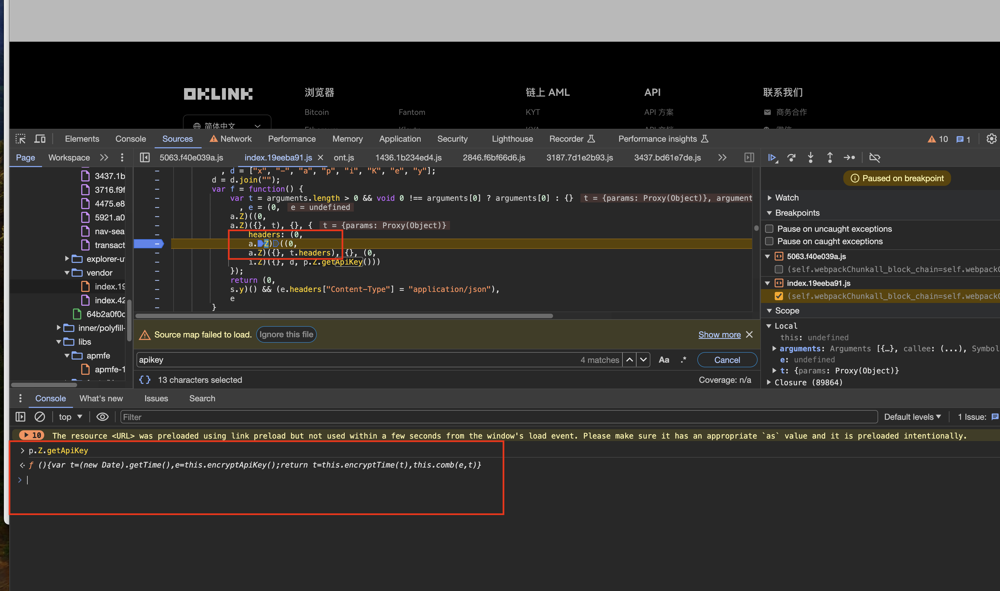

# 头部请求加密参数

- 网站： DKLink（加密货币）
- 网址：https://www.oklink.com/cn/btc/tx-list 

使用方法： 
- 查找 request api路径方法 
- 查找 `herders` or `.headers` 关键字，找到拼接参数的位置  

这种方式只是查找和解密有些不同，定位到代码后，扣取代码都是一致的。

 

## 找到API  

