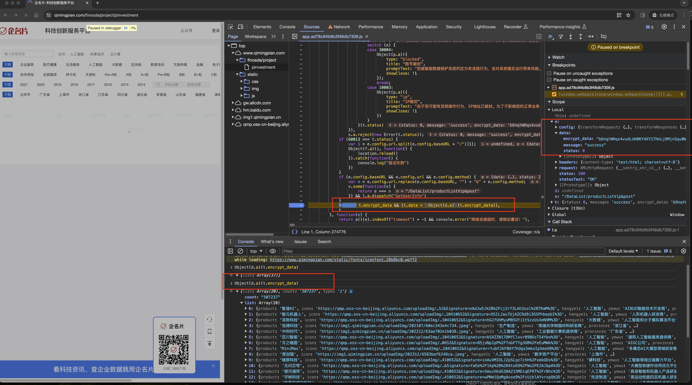
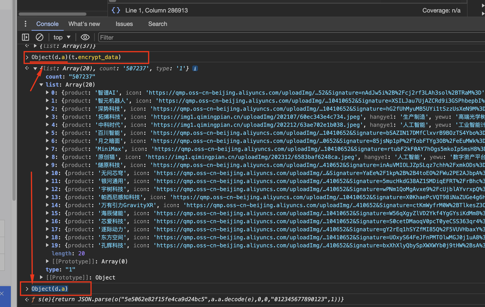
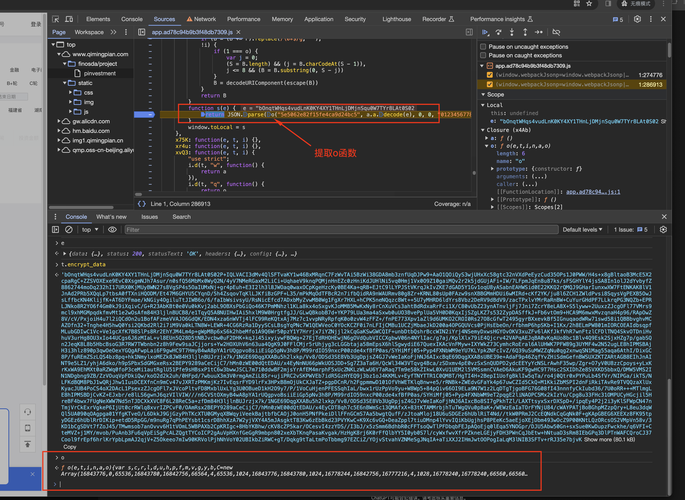
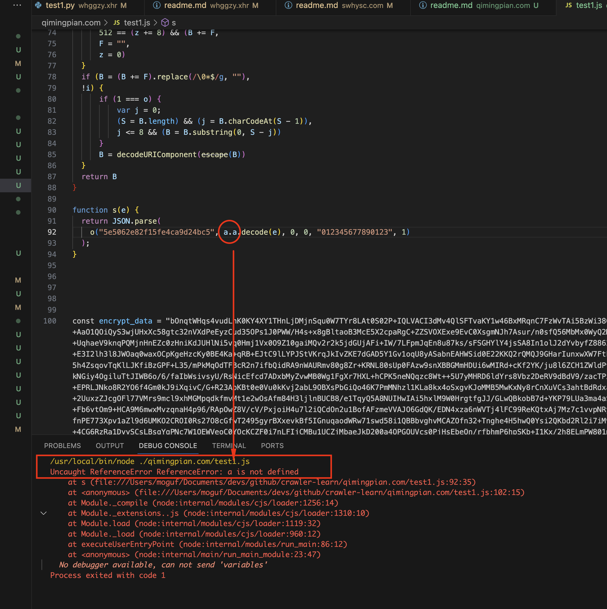
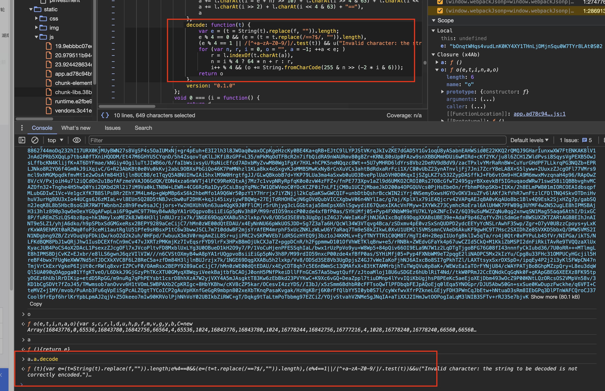
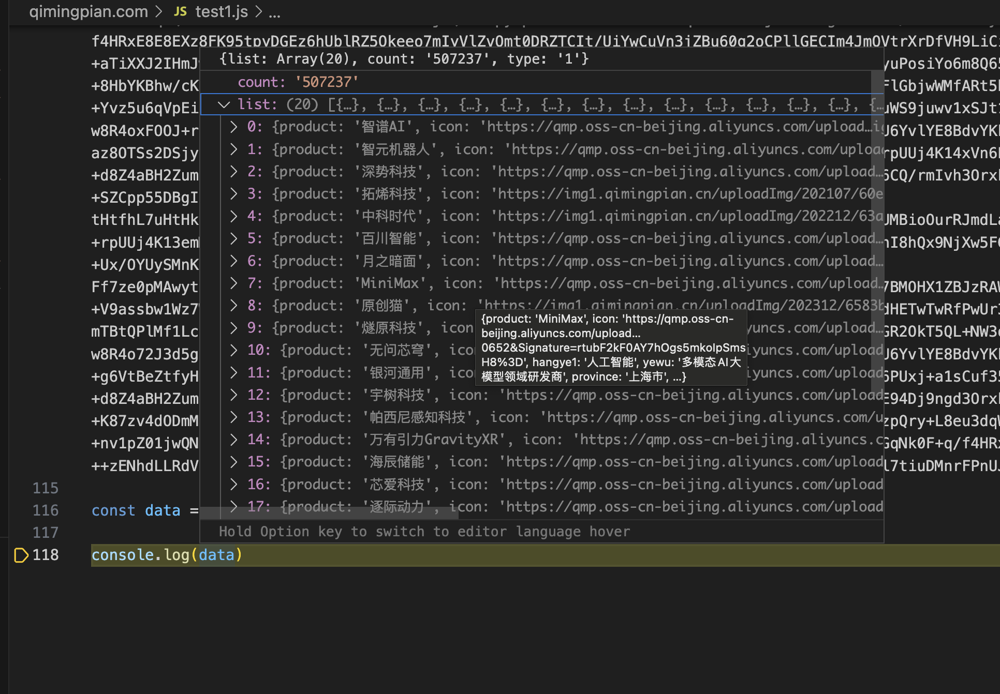
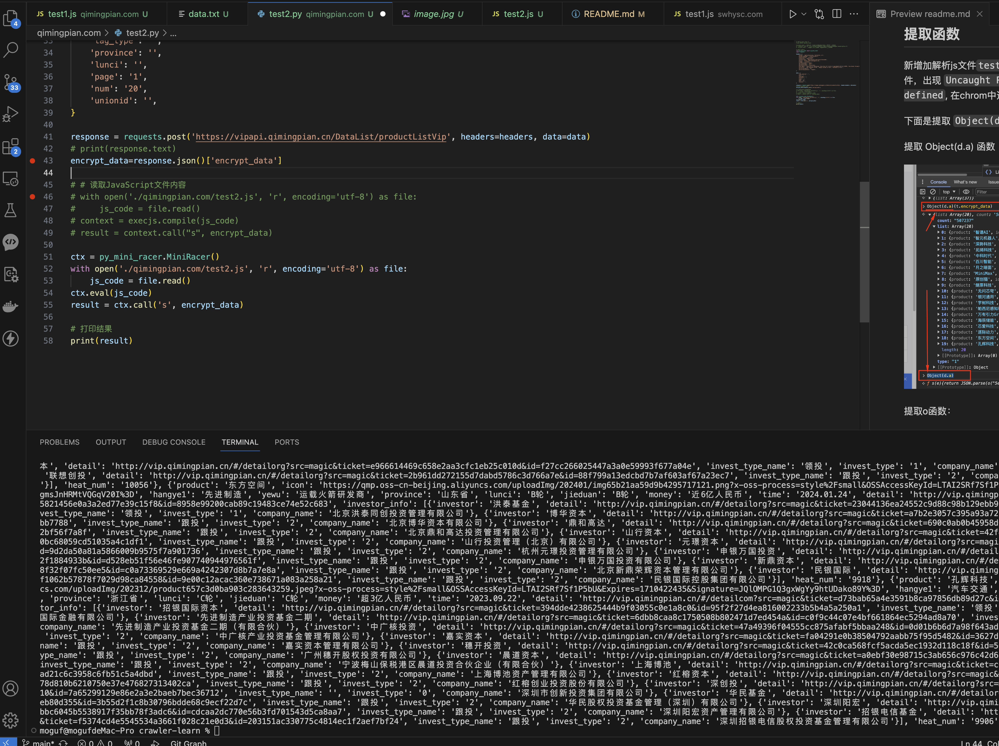

# 完整代码扣取

非标加密 返回内部json数据关键字比较特殊，直接使用查找定位。

站点：qimingpian.com

操作步骤： 
1. 找到函数入口提取函数 
2. 整理出js解密函数入口 
3. 使用python脚本请求并调用js解密 
4. OK


返回的结果类似下面的情况，`encrypt_data` 词比较特殊，可以通过这个词进行搜索。 
```js
{
    "status": 0,
    "message": "success",
    "encrypt_data": "bOnqtWHqs4vudLnK0KY4XY1THnLjDMjnSqu0。。。。"
}
```


下面是解密入口位置




## 提取函数 

新增加解析js文件`test1.js`，把需要解析的加密串复制到文件中。
运行js脚本文件，出现 `Uncaught ReferenceError ReferenceError: xxxx is not defined`, 在chrom中进入函数体逐个提取。

下面是提取 `Object(d.a)`、`o`和 `a.a.decode` 的方法，后面缺少的以此类推。

提取 Object(d.a) 函数



提取o函数： 

在



缺少 a 定义，同样方式对 a.a.decode 函数进行提取





[js最终解析完成的内容](./test1.js)




## 整理成函数输出，方便其他语言调用js解密函数  

文件列表： 
1. [python请求文件 test2.py](test2.py) 
2. [js解密文件 test2.js](test2.js)

最终的执行结果如下图

