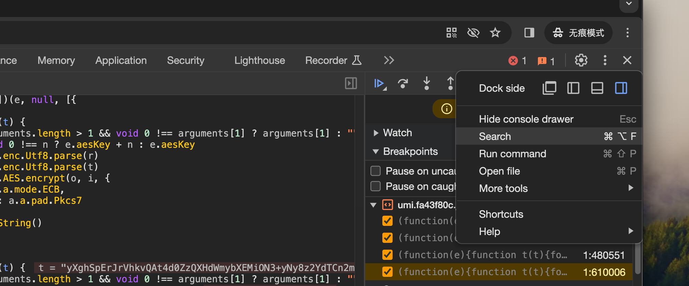

# 标准加密算法

**名称:** 申万宏源证券/现行可充抵保证金名单及折算率  
**网站:** [https://www.swhysc.com/ ](https://www.swhysc.com/swhysc/financial/marginTradingList?channel=00010017000300020001&listId=1) 


使用标准加密算法，对请求结果进行加密的情况。

- **判断依据：** 出现请求结果为一窜base64类的字符串 
- **处理方法：** 使用全局搜到关键字 `decrypy(` 查找，并对位置打断点  

```url
https://www.swhysc.com/swhysc/interface/dsinfo/v1/margin/conver/rate?secuCode=&market=&onlyExchanges=&pageNum=1&pageSize=10
```


**处理步骤：**  

1. 搜索解密位置 
2. 添加断点，翻页触发断点调试 
3. 检查断点对象信息，获取想要的结果内容  


## 搜索解密位置 

> **注意：** 使用全局搜索, 不是页签内的快速搜索 




## 翻页触发断点查看内容

复制暂停位置的代码，在console下查看返回的内容信息,如出现下面类似下面明文信息

```js
a.a.enc.Utf8.stringify(o).toString()

// 返回结果内容：

{"msg":"0-b1841cc0c28261f3-操作成功.","code":"0","data":{"totalPage":740,"dataList":[{"market":"深圳","secuClass":"C","secuType":"股票","converRate":"0.00000000","secuCode":"000016","secuName":"深康佳Ａ"},{"market":"深圳","secuClass":"D","secuType":"股票","converRate":"0.00000000","secuCode":"000017","secuName":"深中华A"},{"market":"深圳","secuClass":"C","secuType":"股票","converRate":"0.65000000","secuCode":"000019","secuName":"深粮控股"},{"market":"深圳","secuClass":"C","secuType":"股票","converRate":"0.00000000","secuCode":"000020","secuName":"深华发Ａ"},{"market":"深圳","secuClass":"B","secuType":"股票","converRate":"0.65000000","secuCode":"000021","secuName":"深科技"},{"market":"深圳","secuClass":"C","secuType":"股票","converRate":"0.65000000","secuCode":"000025","secuName":"特 力Ａ"},{"market":"深圳","secuClass":"C","secuType":"股票","converRate":"0.65000000","secuCode":"000026","secuName":"飞亚达"},{"market":"深圳","secuClass":"C","secuType":"股票","converRate":"0.65000000","secuCode":"000027","secuName":"深圳能源"},{"market":"深圳","secuClass":"C","secuType":"股票","converRate":"0.65000000","secuCode":"000028","secuName":"国药一致"},{"market":"深圳","secuClass":"C","secuType":"股票","converRate":"0.50000000","secuCode":"000029","secuName":"深深房Ａ"}],"pageSize":10,"totalCount":7399,"pageNum":2},"requestId":"b1841cc0c28261f3"}
```

下面的位置就是手机需要的内容


根据代码段的样式，可以直接使用js的标准库进行解密

原样式

```js
  ...
    value: function(t) {
        var n = arguments.length > 1 && void 0 !== arguments[1] ? arguments[1] : ""
            , r = void 0 !== n ? e.aesKey + n : e.aesKey
            , i = a.a.enc.Utf8.parse(r)
            , o = a.a.AES.decrypt(t, i, {
            mode: a.a.mode.ECB,
            padding: a.a.pad.Pkcs7
        });
        return a.a.enc.Utf8.stringify(o).toString()
    }
  ...
```

[修改后解密样式](test1.js)  里面aesKey的密钥是个常量 `u.aesKey = "rewin-swhysc1234"` 

> **注：** 安装 `npm install crypto-js` 

```js
const CryptoJS = require('crypto-js')

const t = 'yXghSpErJrVhkvQAt4d0ZzQXHdWmybXEMiON3+yNy8z2YdTCn2m2UO3L20J8MUhRWkTnWM2t3JYft4y8sbT2uGZ38JN1EIYmuSBIkfzx/RAsWKyIrd/D68XVmUfKCUqIJB06JFNZigILAt6cvPcRpxK94NvVYGf/a9XbKALqDaI3FwALWcISrEtOaYoyDS68LRdhYo246M1Zkvki0tVjDGJroy+nxUbCaymLBPku2wQn/BE/1zVro+JE2Q8OFGrj0zoq7nj6F4PctqTfNJELpLV8JormIlmdZBKEdI7laV0kHTokU1mKAgsC3py89xGn6IZZNugPRy8Mo8unRZsM9TcXAAtZwhKsS05pijINLrwtF2FijbjozVmS+SLS1WMMYmujL6fFRsJrKYsE+S7bBFm+Y9FHR76Y23SgfyxBZUuYQm97MQ0qx7GMjGEKfCM3r1l1ywBjuvECPIZH9wZ4nqbFsIsbVN8CyyTMEK8s3xRzu03q3avmUyTiFX64QJCyeO5zTFsSjqLCTgESyH2TW6+YoT3CvA77mZBrZI0jDTJU5KSNw2ZmyPF3nt9xbvwFf4Wfm5wZKVwW4xIDvczHrp3DOPLVvQCGprVEXDmwyuSTRPfN42EalRUn7K4YisfjpsWwixtU3wLLJMwQryzfFHO7Terdq+ZTJOIVfrhAkLJ47nNMWxKOosJOARLIfZNbA54ouYr/J0bQ10hYeX/OA1TkpI3DZmbI8Xee33Fu/AWof6mZq2CERSPQd0X4Hrmd0Qln2yZqJ8gXAQ79v5/ax3KkzF8g9/dF0HYnZsrd4OmmxbCLG1TfAsskzBCvLN8UMu51s7AliXTI0gAKAQVKnnjuc0xbEo6iwk4BEsh9k1uvmKE9wrwO+5mQa2SNIw0yVOSkjcNmZsjxd57fcW78BQWV2hGBsRyGVM/4t15VQg0auwysvWqapuS68etP2qiYdCuYxXUza/8Ws1sLHkzguVdFXy2aRQyv47lz38d2dKHuJ+ObivDRLTKzRqlxlRCWBst+7jxn5SO2fWVlnARsJtFZ3Ivou3IZt4oob2zAky28iLP87mSqoDUgYSyRf8jXnmZs9QFELqFAfHbgpDJ0XkH7k7n7rj8sET5UA4ZV1KOHwpms6zrKLL8puxBCsoZt8FNMcWLKh1VjuuJFszhiLoMqiIEJFrNKxfGGszPiVtt5KYyRJg/wErhG7r3z3xS0LqMEgZFWHJ9evC0l65P887ZvAnr+uFxPQyLwHTQ/BPcw8m1vpFqEc6p6ETsD+857NgdMjVORVvdtJ5b9CqrhbO1kEL686uxD62J/jDP5+fy3JVsW/wU/uhgD1GqUrpjIG50h/ABFYdm4AJeQVngLYcUSTuxAjT3FNjuxHwHL0GX78SPABxIqZIztHJ2wRYUrkKJwfCsKMMhIhjSvKZrJ2y78DZWs1Ml8B5O5Dniv771ohld1OgQJjMx9PtqD8/4C7WQQvrzq7EPrYn+MM/n5/LclWxb/BT+6GAPUapSumMgbnSH8AEVh2bgAl5BWeAthxRJO7ECNPcU2O7EfAcvQZfvxI8AHEipkjO0cnbBFhSuQonB8KwowyEiGNK8pmsnbzyjSbF/K3kyuWBlS6QseaqNvGWPwfEZPaXCKbh0fCRrtZBC+vOrsQ+tif4wz+fn8tyVbFv8FP7oYA9RqlK6YyBudIfwARWHZuACXkFZ4C2HFEk7sQI09xTY7sR8By9BlAPP9IA0eswpT41fvp39RHZCicHwrCjDISIY0rymaydtb4ZWNDq5cV8WXXttnkWc04XKfib+wQ8zmpfFKSkHCk5AP4Hdu1y5tVTB93rvWrQY/7cFyFIIllWGaxiTrwPwUpkdU3tfJJdTBzGtLN94mFvKdeF95FMLt+62HTiILg0ZURCZ4g26B4nasLpgoSN2q'


r = 'rewin-swhysc1234'
i = CryptoJS.enc.Utf8.parse(r)
o = CryptoJS.AES.decrypt(t, i, {mode: CryptoJS.mode.ECB,padding: CryptoJS.pad.Pkcs7});
const decodedText = CryptoJS.enc.Utf8.stringify(o).toString()

console.log(decodedText);
```