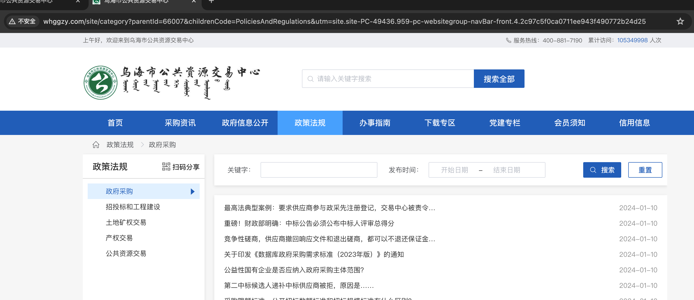
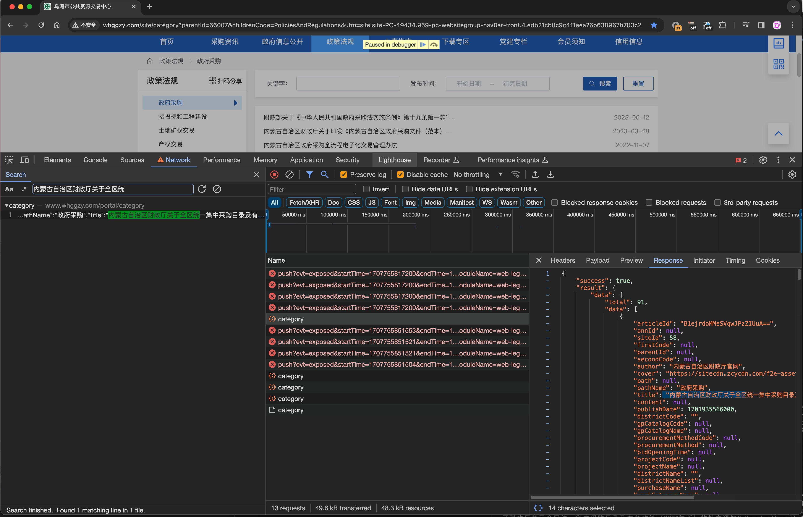
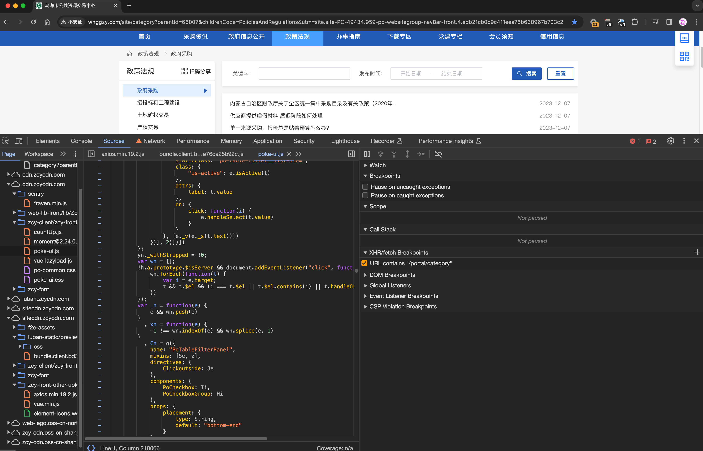
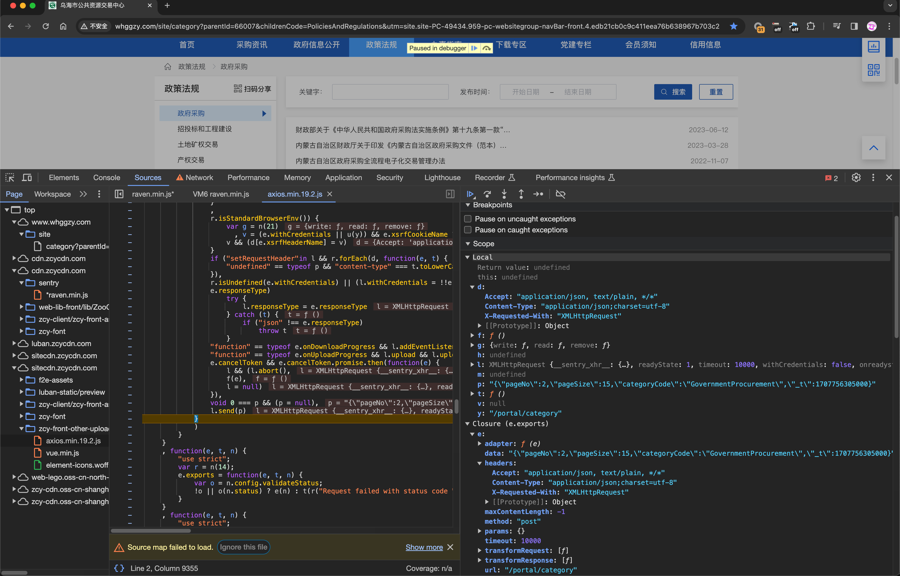

# 基础xhr处理流程

> **level:** 1

爬取网站： http://www.whggzy.com/ 
乌海市公共资源交易中心/政策法规




1. 检查网站是否是动态页面数据 
2. 复制请求path，在Source tab中的XHR架断点  
3. 翻页等待断点进入 
4. 找到"XMLHttpRequest"请求信息 
5. OK

## 1. 检查网站是否是动态的

选择要抓去内容`财政厅关于全区统`, 在Network页签选择搜索🔍对所有的请求信息进行检索。 
下面内容就是检索到的请求结果信息。确定是个动态网页可以使用此API进行数据爬取



## 2. 复制Path加XHR断点 



## 3. 翻页出发断点位置

暂停的代码的位置就是实际`XMLHttpReqpest`向服务器发送的请求，右侧能看到所有的请求变量信息。



## 4. 找到XMLHttpRequest执行请求

请求体信息并没有加密信息直接可使用，只需要处理一下13位时间戳。

```python
import time
import requests

timestamp = int(time.time() * 1000)

handler = {
    "Accept": "application/json, text/plain, */*",
    "X-Requested-With": "XMLHttpRequest",
    "Content-Type": "application/json;charset=utf-8",
    'User-Agent': 'Mozilla/5.0 (Macintosh; Intel Mac OS X 10_15_7) AppleWebKit/537.36 (KHTML, like Gecko) Chrome/121.0.0.0 Safari/537.36'
}
data = '{"pageNo":2,"pageSize":15,"categoryCode":"GovernmentProcurement","_t":%d}' % (timestamp)

url = 'http://www.whggzy.com/portal/category'
response = requests.post(url, headers=handler, data=data)
print(response.text)
print(response.status_code)

with open('resultdata.json', 'w', encoding='utf-8') as f:
    f.write(response.text)
```

