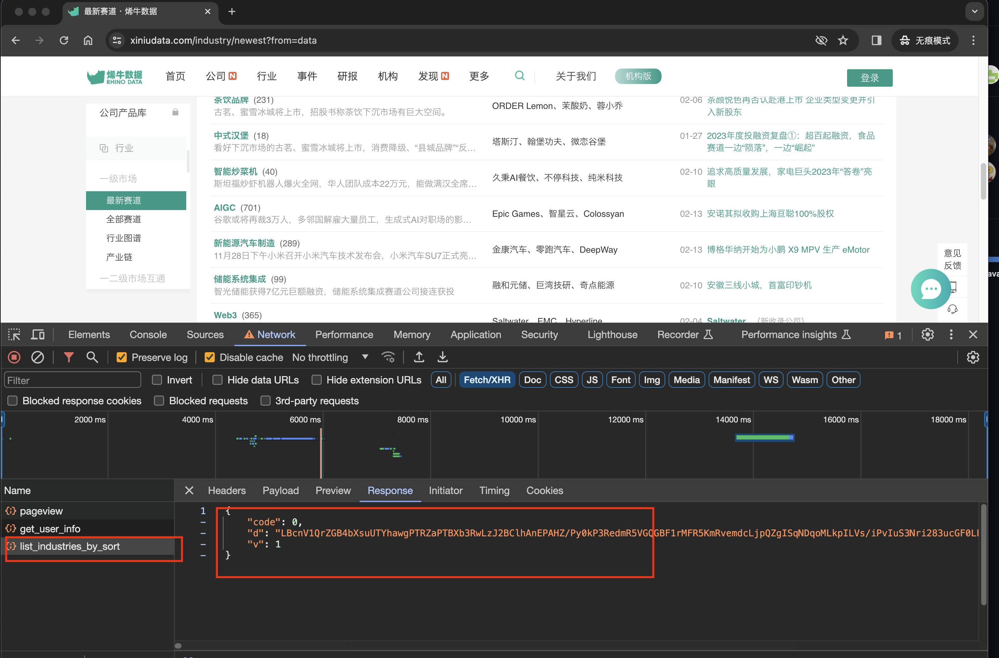
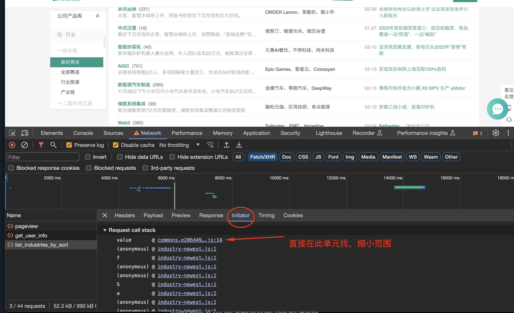
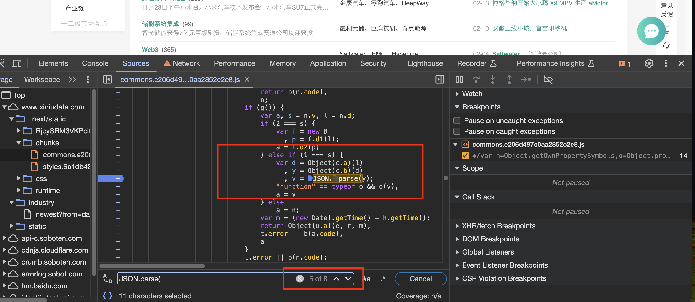
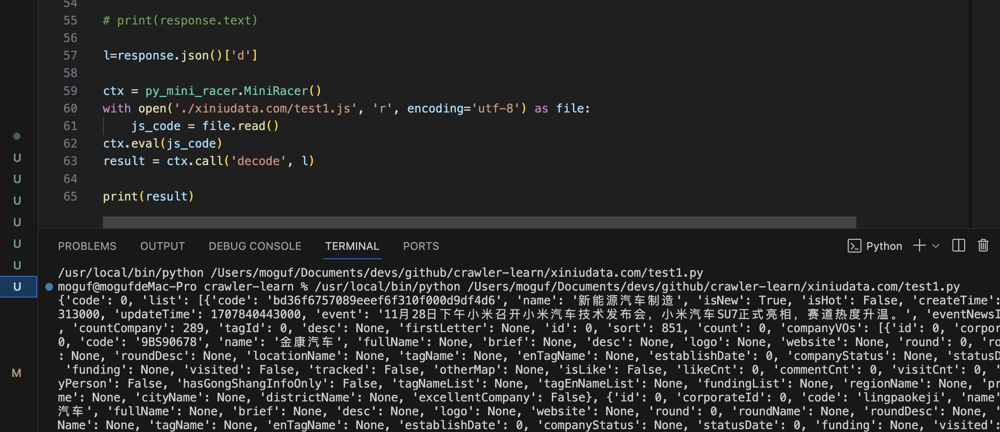

# 没有特定关键字定义

网站：烯牛数据   
地址：https://www.xiniudata.com/industry/newest?from=data  

在没有特定关键字能搜索的情况下，可以尝试查找Json的数据解析位置。这种模式通常前后端数据会使用JSON进行交互进行转换时进行定位



## 定位JSON.passe

直接在 Initator中选择第一条js进入调用文件位置，搜索`JSON.parse(`



找到字符串解码位置断点

有效代码位置大致样式,数据一般都是从外部传入进行解析。 y值是由外部的l传入转换
```js
var d = Object(c.a)(l)
    , y = Object(c.b)(d)
    , v = JSON.parse(y);
"function" == typeof o && o(v),
a = v

```



> **注：** 不需要在对象json化的的位置断点 

如此类代码，把对象转成json，再解析成对象的过程（脱裤子放屁）
```js
// 无效代码位置
// 无效代码位置
// 无效代码位置
var s = []
    , f = c[0]
    , p = c[1]
    , h = JSON.parse(JSON.stringify(f));
h.list = JSON.parse(JSON.stringify(f)).list.splice(0, 7);
```


## 滚动页面触发断点  

找到代码位置，复制代码创建 test1.js 文件进行收集解析函数  


## 抓去解析代码

大致调用代码，此不是最终代码其中翻页参数payload和sig参数需要处理

文件列表： 
- [json 解析js文件 test1.js](test1.js) 
- [python 请求数据脚本 test1.py](test1.py) 

返回的结果内容样式




