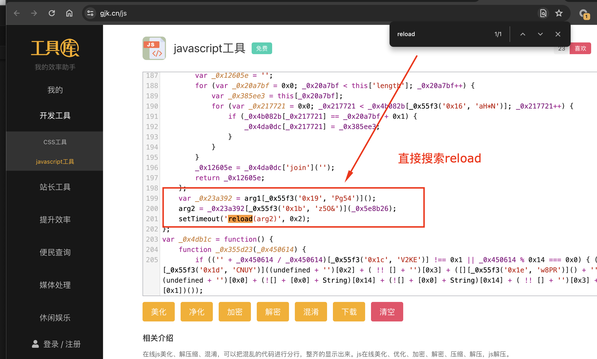

# Cookie 加密模式

- 网站：雪球 
- 网址：https://xueqiu.com/today 


## 样式


处理步骤： 
1. 重新加载页面进入debug模式   


## 1. 调试进入debug

步骤： 
1. 打开 开发者工具 页面  
2. 清除cookies 
3. 刷新页面 
4. 加载后会自动进入debug模式  


进入调试页面后显示的状态，上面页面是空白的。下面source调试入口有debugger可以进入VM（虚拟环境）


step（F9） 调试进入VM入口


## 2. 输出第一次生成Cookies请求 

第一次请求的Cookies的请求创建 [test1.py](./test1.py)的结果打印到输出到文件[firstresponse.html](./fristresponse.html)

下面部分样式可以看到script是加密的，上面部分有设置`setCookie("acw_sc__v2", x)`的调用。这个`acw_sc__v2`参数就是所需要`x`变量内容。

```js
<html><script>
var arg1='68B53C07D016825AF396D92D2A77CE286B5515A2';
function setCookie(name,value){var expiredate=new Date();expiredate.setTime(expiredate.getTime()+(3600*1000));document.cookie=name+"="+value+";expires="+expiredate.toGMTString()+";max-age=3600;path=/";}
function reload(x) {setCookie("acw_sc__v2", x);document.location.reload();}
</script>
<script name="aliyunwaf_6a6f5ea8">var _0x4818=['\x63\x73\x4b\x48\x77\x71\x4d\x49','\x5a\x73\x4b\x4a\x77\x72\x38\x56\x65\x41\x73\x79','\x55\x63\x4b\x69\x4e\x38\x4f\x2f\x77\x70\x6c\x77\x4d\x41\x3d\x3d','\x4a\x52\x38\x43\x54\x67\x3d\x3d','\x59\x73\x4f\x6e\x62\x53\x45\x51\x77\x37\x6f\x7a\x77\x71\x5a\x4b\x65\x73\x4b\x55\x77\x37\x6b\x77\x58\x38\x4f\x52\x49\x51\x3d\x3d',
...
```

> **解码：** 下面的混淆加密直接可以找**js在线解码**, 解码器能恢复ascii 16进制字符串  

html内部处理逻辑完成第二次加载当前页面：`https://xueqiu.com/today` 

1. 文件内容脚本会调用重载页面`reload(x)` 
2. 重载时会调用`setCookie`设置`acw_sc__v2`为`x`参数值 
3. 脚本重新请求当前页面`document.location.reload();`，完成第二次加载  

## 3. 查找定位加载reload(x)脚本入口  

找个线上js解码的站点，把上面的字符串解码。下面的样式就是解码的可以方便的找到`reload(x)`函数调用入口



> **在线js解码站点：** https://www.gjk.cn/js 


打断点调试


> **注：** 内部都是定时器，时间过长会出现无线启动VM虚拟环境的断点，这种情况需要重新起页面再调试  

## 4. 


> 注： 需要进行二次检查，确定那些是变量和那些是常量  